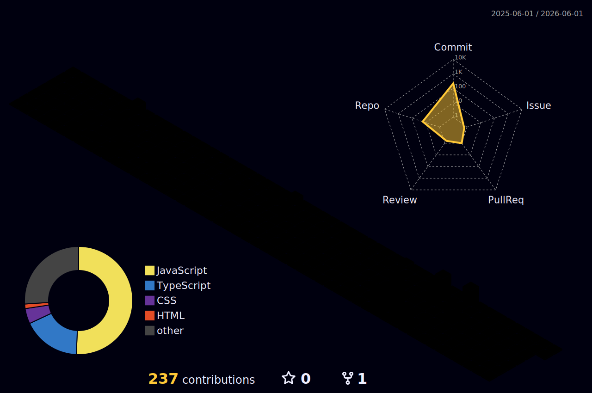

<h1 align="center">Hi 👋, I'm Nisarg</h1>
<h3 align="center">Developer • Hackathon Enthusiast • Video Editor</h3>

---

## 🧱 3D Contribution Graph

---

## 📈 GitHub Activity

---

## 🧑‍💻 About Me

- 💻 Core Member of **Student Developers Club**
- 🏆 Hackathon participant & winner  
- 🎬 Passionate **Video Editor**
- 🚀 Love building creative tech projects  
- 🌱 Currently learning **Full Stack Development**

---

## ⚡ Tech Stack

---

## 📊 GitHub Stats

---

## 📊 Most Used Languages

---

## 📊 Developer Metrics

---

## 📚 Currently Learning

---

## 🌐 Connect With Me

---

🟡 **Eat Bugs Like Pac-Man • Build Cool Things • Keep Coding**

